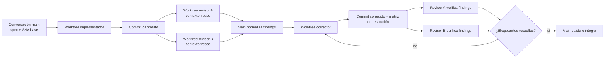

# Gravity Room Mobile v2 — plan de producto, arquitectura y entrega

Estado: plan activo; tracker actual aceptado como baseline

Fecha: 2026-07-29

Ámbito: `apps/frontend/mobile` y los contratos compartidos/API estrictamente necesarios

## 1. Objetivo

Rehacer la experiencia móvil como compañero de entrenamiento, inspirado en FitNotes en su foco y
simplicidad, sin sustituir por ahora el tracker existente:

- llegar al siguiente entrenamiento y empezar a registrar en pocos segundos;
- gestionar programas y rutinas sin ruido de producto;
- registrar cada serie de forma fiable, incluso sin red;
- mantener cuenta, preferencias y estado de sincronización en Perfil;
- dejar las analíticas avanzadas para web/desktop;
- ofrecer información de ejercicios dentro del flujo, no como una cuarta sección principal.

La reescritura no implica borrar infraestructura que ya funciona. Se conservarán los contratos de
dominio, la autenticación, SQLite y la cola offline cuando superen la auditoría de cada slice. Se
reemplazarán el shell, la navegación y las pantallas de Programas/Perfil que lo necesiten. El tracker
actual se conserva como producto aceptado hasta una decisión posterior explícita.

## 2. Resultado de la auditoría inicial

### Base que merece conservarse

- Expo 54, React Native 0.81 y TypeScript estricto.
- `@gzclp/domain` como fuente única para esquemas y progresión.
- Sesión móvil con access/refresh token y almacenamiento seguro.
- SQLite con migraciones versionadas.
- Persistencia local de resúmenes, detalles y definiciones de programa.
- Cola de mutaciones y reintento de resultados.
- Tracker actual, incluyendo su flujo de registro y progresión.
- i18next con catálogos español/inglés.
- 147 pruebas móviles actuales y `typecheck` verde como red de regresión.

### Partes que se deben sustituir o ampliar

- El estado manual de dos pestañas no es una arquitectura de navegación.
- Programas mezcla listado, catálogo, alta y entrada al tracker en una sola pantalla.
- Perfil solo muestra identidad y cierre de sesión.
- La cola offline usa operaciones y payloads genéricos; le faltan estados de reintento observables,
  coalescencia y una política de conflictos explícita.
- El cliente móvil sigue escribiendo llamadas HTTP a mano. `packages/api-client` aún contiene
  utilidades, no el contrato completo.
- No existe lint específico de mobile, navegación deep-linkable, E2E nativo ni pipeline de release
  definido.

El rediseño set-a-set, las sesiones, el historial y el temporizador quedan como mejoras futuras; no
son requisitos de esta primera versión móvil.

### Gaps del servidor que condicionan el producto

- La API crea instancias desde el catálogo, pero no expone un endpoint de primera clase para crear y
  editar definiciones personalizadas.
- Los resultados admiten `setLogs` y `completedAt`, pero no existe una entidad de sesión con duración,
  notas y estado propio.
- La creación offline de una instancia no tiene todavía una clave de idempotencia; el tracking
  offline sí puede apoyarse en los upserts por workout/slot.

Estos gaps deben resolverse mediante contratos explícitos. No se implementarán atajos basados en el
endpoint de importación.

## 3. Alcance de producto

### Navegación principal

La aplicación autenticada tendrá exactamente tres destinos principales:

1. **Programas**
2. **Tracker**
3. **Perfil**

Autenticación vive fuera de esas pestañas. Búsqueda de ejercicios, detalles de ejercicio, edición de
programa, configuración inicial e historial son rutas secundarias o modales.

### Programas

Responsabilidades:

- mostrar programa fijado/activo y progreso operativo;
- listar programas activos, completados y archivados;
- explorar presets del catálogo;
- previsualizar días, ejercicios, reglas y duración;
- configurar pesos iniciales y opciones antes de empezar;
- renombrar, archivar, reactivar, completar y eliminar una instancia;
- crear y editar una rutina propia antes de declarar Mobile v2 completo.

No incluye gráficos ni recomendaciones analíticas.

### Tracker

El tracker existente queda aceptado como baseline funcional. Esta versión mantiene su registro,
progresión, navegación entre workouts y comportamiento offline actuales. Solo se corregirán fallos de
integridad, sesión o sincronización que afecten a ese flujo; no se hará ahora una reescritura set-a-set
ni se añadirán sesiones, historial o temporizador.

### Perfil

- identidad y edición de nombre;
- idioma;
- unidades kg/lb y redondeo de discos;
- temporizador de descanso por defecto;
- estado de sincronización y acción de reintento;
- exportar/importar datos cuando el contrato esté disponible;
- cerrar sesión y eliminar cuenta con confirmaciones apropiadas;
- versión, privacidad y soporte.

Perfil no alberga analíticas.

### Wiki/catálogo de ejercicios

Decisión propuesta: **sí en móvil, pero contextual y sin cuarta pestaña**.

- Se abre al tocar un ejercicio desde Programas o Tracker.
- El selector permite buscar los 811 ejercicios por nombre, grupo muscular y equipamiento.
- La ficha básica funciona para todo el catálogo.
- Los artículos editoriales completos se muestran solo donde exista contenido validado.
- El índice global puede vivir como ruta secundaria desde Programas.
- Diagramas corporales, SEO y contenido largo siguen siendo prioritariamente web.

Así se reutiliza la información durante la acción concreta sin desplazar Tracker de la navegación
principal.

### Fuera de alcance de Mobile v2

- insights, forecasts, charts avanzados y dashboard analítico;
- edición/administración de artículos editoriales;
- funciones sociales;
- planificación nutricional;
- paridad visual con la web;
- reintroducir servicios o infraestructura retirados.

## 4. Arquitectura objetivo

### Shell y navegación

- Adoptar Expo Router sobre React Navigation, instalado con la versión compatible con Expo.
- Usar rutas tipadas y deep links.
- Separar grupo de autenticación, grupo de tabs y rutas modales/secundarias.
- Mantener `Programas`, `Tracker` y `Perfil` como tabs estables.
- Recordar la ruta del tracker y reanudar la sesión tras background/reinicio.

Árbol propuesto:

```text
src/app/
  _layout.tsx
  (auth)/
    login.tsx
    signup.tsx
    verify-email.tsx
  (tabs)/
    _layout.tsx
    programs/
      index.tsx
    tracker/
      index.tsx
    profile/
      index.tsx
  program/
    [instanceId].tsx
    new.tsx
    editor/[instanceId].tsx
  workout/
    history.tsx
    [sessionId].tsx
  exercise/
    index.tsx
    [exerciseId].tsx
  sync.tsx
```

Antes de implementar se comprobará que `src/app` no colisiona con los módulos de aplicación actuales;
estos pasarán a `src/core` o `src/providers`.

### Capas

```text
routes/screens
    ↓
feature controllers + view models
    ↓
use cases (start workout, log set, finish workout, archive program)
    ↓
repositories
    ├── SQLite (estado operativo local)
    ├── outbox (mutaciones pendientes)
    └── API client (sincronización)
    ↓
@gzclp/domain (reglas y esquemas canónicos)
```

Reglas:

- Las pantallas no llaman a `fetch` ni escriben SQL.
- Los casos de uso escriben primero el estado local y la outbox en una misma transacción.
- React Query gestiona fetch/status e invalidación, no sustituye a SQLite como fuente local.
- Todo JSON de red o SQLite se trata como `unknown` hasta validarlo.
- Estados de carga/sync se modelan como uniones discriminadas, no como combinaciones de booleanos.
- Ninguna pantalla reimplementa progresión, caps o reglas GZCLP.

### Persistencia local

Evolucionar el esquema mediante migraciones append-only:

- `program_summaries`
- `program_details`
- `program_definitions`
- `workout_sessions`
- `workout_set_logs`
- `exercise_catalog`
- `user_preferences`
- `outbox_mutations`

La migración debe preservar instalaciones actuales. El borrado y recreación de la base solo se permite
en pruebas o mediante una acción explícita del usuario.

Las filas v1 carecen de propietario. La migración v2 no puede atribuirlas a la sesión activa: caches y
cola legacy entran en cuarentena con claves estables y solo se reclaman tras validar ownership con el
servidor. Las tablas operativas se particionan por `owner_user_id`; un cambio A → logout remoto fallido
→ B no expone ni reproduce filas de A.

### Sincronización

La outbox tendrá un contrato cerrado:

- operación discriminada y payload validado;
- `idempotency_key`;
- `attempt_count`;
- `next_attempt_at`;
- `last_error_code`;
- `created_at` y orden estable;
- coalescencia de cambios repetidos del mismo set/slot;
- serialización por entidad y paralelismo solo entre entidades independientes.

Eventos que disparan flush:

- sesión restaurada;
- conectividad recuperada;
- app vuelve a foreground;
- finalización de una sesión;
- reintento manual.

Política inicial:

- registro de sets/resultados: último cambio local confirmado por orden de outbox;
- ediciones concurrentes externas: detener y mostrar conflicto cuando no pueda probarse el orden;
- altas no idempotentes: online-only hasta que la API acepte idempotency keys;
- nunca descartar una mutación fallida sin confirmación o resolución visible.

### Contrato API

Prioridad técnica temprana:

1. ampliar `packages/api-client` con transporte autenticado y parsers runtime;
2. reutilizar esquemas de `@gzclp/domain` donde ya sean canónicos;
3. no copiar el cliente generado web dentro de mobile;
4. si cambia una ruta, regenerar el cliente web y comprobar drift;
5. añadir endpoints explícitos para definiciones propias y sesiones si los slices correspondientes los
   necesitan.

### Diseño y accesibilidad

- Objetivos táctiles mínimos de 44x44.
- Contraste AA, Dynamic Type y áreas seguras.
- Haptics solo como confirmación adicional.
- Todos los strings en i18next, incluidos labels de accesibilidad.
- Flujos operables con lector de pantalla.
- Estados offline y error perceptibles sin depender solo del color.
- Componentes base pequeños: `Screen`, `Card`, `Button`, `IconButton`, `Field`, `Banner`,
  `EmptyState`, `SyncBadge`, `BottomSheet`.

## 5. Roadmap por slices verticales

Cada slice debe ser integrable, demostrable y pasar por el circuito de cuatro worktrees.

### M0 — Contratos y baseline

Alcance:

- congelar pruebas de comportamiento que se preserva;
- añadir lint mobile;
- documentar rutas, modelo local y política de sync;
- decidir forma exacta de `workout_sessions` y API de definiciones propias;
- crear fixtures canónicos de programa, workout y outbox;
- congelar métricas estáticas reproducibles (LOC, suites, casos, catálogos y versión SQLite);
- registrar como deuda que las métricas nativas requieren el harness de M8.

Aceptación:

- baseline reproducible;
- cero strings faltantes ES/EN;
- SQL contractual de migración probado en SQLite real sobre base vacía y v1 con filas, sin desplegarlo
  hasta adaptar los repositorios;
- ADRs de navegación, persistencia y sincronización aceptados.

M0 no afirma tiempos de arranque, tamaño de bundle ni render medidos. Sin un build, dispositivo,
escenario, repeticiones y percentiles controlados, una cifra del host no constituye evidencia.

### M1 — Shell, navegación y sistema visual

Alcance:

- Expo Router;
- auth stack y tabs Programas/Tracker/Perfil;
- providers, error boundary y arranque de base de datos;
- tokens y componentes base;
- deep links mínimos.

Aceptación:

- restauración de sesión aterriza en Tracker;
- usuario sin sesión aterriza en Login;
- las tres tabs preservan su estado;
- navegación accesible y traducida;
- ningún cambio funcional todavía en contratos de resultados.

### M2 — Programas: biblioteca y gestión

Alcance:

- programa fijado;
- listas activo/completado/archivado;
- catálogo y ficha de preset;
- setup validado por `ProgramDefinition`;
- crear, renombrar, archivar, reactivar, completar y eliminar;
- cache local y estados offline de lectura.

Aceptación:

- iniciar un preset requiere configuración válida;
- crear es online-only y comunica por qué;
- gestionar una instancia actualiza local/servidor sin listas incoherentes;
- borrar exige confirmación y limpia datos locales relacionados tras éxito.

### M3 — Tracker set-a-set offline (diferido)

El tracker actual se mantiene. La reescritura set-a-set, las sesiones explícitas y cualquier cambio
de UX del registro requieren una nueva decisión de producto y no bloquean Mobile v2.

### M4 — Finalización, historial y temporizador (diferido)

Historial por sesiones, duración, notas y temporizador quedan fuera de la primera versión. Si se
retoman, tendrán su propio ciclo implementador/revisores/corrector y no se mezclarán con Perfil.

### M5 — Perfil y control de datos

Alcance:

- identidad;
- kg/lb, idioma, redondeo y descanso;
- panel de sincronización;
- export/import cuando exista contrato;
- cerrar sesión y eliminar cuenta.

Aceptación:

- preferencias sobreviven reinstanciación de providers;
- cambiar unidades no muta el valor canónico almacenado;
- cerrar sesión no mezcla datos entre usuarios;
- cola pendiente provoca advertencia antes de borrar datos locales;
- eliminación de cuenta respeta la semántica existente de soft delete.

### M6 — Programas personalizados

Alcance:

- API explícita para definición propia;
- editor móvil de días, slots, ejercicios, series y reglas soportadas;
- preview antes de guardar;
- duplicar preset o rutina;
- validación íntegra con `ProgramDefinitionSchema`.

Aceptación:

- no se usa import como atajo de creación;
- definiciones inválidas no llegan a persistencia;
- editar una definición usada por una instancia no altera silenciosamente el historial;
- duplicación produce una identidad nueva y trazable;
- web y mobile consumen el mismo contrato.

### M7 — Catálogo/wiki contextual

Alcance:

- cache paginada del catálogo de ejercicios;
- búsqueda y filtros;
- selector reutilizable por editor y tracker;
- ficha básica universal;
- artículo completo cuando exista contenido.

Aceptación:

- búsqueda útil offline tras primera sincronización;
- ejercicio personalizado queda distinguido del sistema;
- ausencia de artículo no produce ruta rota;
- no aparece una cuarta tab.

### M8 — Hardening y release

Alcance:

- E2E nativo de los recorridos críticos;
- harness nativo reproducible para arranque, bundle y render del tracker;
- baseline antes/después capturada con dispositivo, build, escenario, repeticiones y percentiles;
- accesibilidad, rendimiento, crash reporting y observabilidad;
- iconos, splash, permisos, versionado y configuración de build;
- prueba de upgrade desde la app actual;
- documentación operativa y checklist de store.

Aceptación:

- recorridos críticos verdes en Android e iOS;
- baseline nativa antes/después registrada antes de aceptar objetivos o regresiones de rendimiento;
- cero pérdida de datos en matriz offline/foreground/reinicio;
- export/bundle de ambas plataformas;
- migración v1→v2 probada con fixtures reales anonimizados;
- rollback documentado.

## 6. Flujo obligatorio de cuatro worktrees

La conversación principal actúa como orquestador y no implementa el slice. Mantiene alcance, decisiones,
estado y handoff. Los cuatro worktrees de ejecución son:

| Rol           | Directorio sugerido             | Responsabilidad                                                                  |
| ------------- | ------------------------------- | -------------------------------------------------------------------------------- |
| Implementador | `.worktrees/mobile-v2-impl`     | Implementar un slice y sus pruebas                                               |
| Revisor A     | `.worktrees/mobile-v2-review-a` | Revisión integral con énfasis en spec, UX, accesibilidad y tests                 |
| Revisor B     | `.worktrees/mobile-v2-review-b` | Revisión integral con énfasis en datos, offline, concurrencia, seguridad y tipos |
| Corrector     | `.worktrees/mobile-v2-fix`      | Resolver y verificar el conjunto de findings aceptados                           |

Los revisores reciben contexto fresco. Para cada slice se abren tareas nuevas sin heredar la conversación
completa. Su paquete mínimo contiene:

- `AGENTS.md`;
- este documento;
- spec concreta del slice;
- SHA base y SHA del implementador;
- diff y comandos de verificación;
- prohibición de modificar código.

El implementador y el corrector saben que no están solos, no revierten cambios ajenos y trabajan solo en
los ficheros asignados.

### Grafo por slice



La reverificación no añade roles ni worktrees: reutiliza los dos worktrees de revisión con una tarea
fresca centrada en los findings.

### Ciclo Git

1. Main fija `BASE_SHA` y congela la spec del slice.
2. Implementador crea una rama corta `codex/mobile-v2-<slice>-impl` desde `BASE_SHA`.
3. Implementador entrega un único candidato revisable con pruebas.
4. Ambos revisores inspeccionan exactamente el mismo SHA en worktrees detached/read-only.
5. Main deduplica findings sin rebajar severidad ni ocultar desacuerdos.
6. Corrector crea `codex/mobile-v2-<slice>-fix` desde el SHA candidato.
7. Corrector entrega cambios y una tabla `fixed / rejected-with-reason / not-reproduced`.
8. Los dos revisores verifican bloqueantes sobre el SHA corregido.
9. Main ejecuta la puerta final e integra en `codex/mobile-v2`.
10. Al terminar Mobile v2, la rama de integración entra en `main` mediante un único handoff revisable.

Los cuatro directorios físicos pueden reutilizarse, pero las tareas de revisión se recrean en cada slice
para conservar contexto fresco. Ningún revisor revisa un commit distinto del indicado.

### Formato obligatorio de finding

```text
ID: M3-A-001
Severidad: P0 | P1 | P2 | P3
Criterio afectado:
Archivo y línea:
Evidencia/reproducción:
Impacto:
Corrección mínima sugerida:
```

Bloquean integración:

- cualquier P0/P1;
- criterio de aceptación incumplido;
- prueba relevante roja o inexistente;
- migración destructiva/no reversible;
- pérdida, mezcla o duplicación de datos;
- strings visibles sin localizar;
- casts usados para ocultar un contrato inválido.

P2/P3 pueden diferirse solo si Main registra la deuda y el motivo.

### Handoff de vuelta a la conversación main

Después de cada slice, Main publica:

- alcance realmente entregado;
- SHA candidato y SHA corregido;
- findings por revisor;
- resolución de cada finding;
- checks ejecutados con resultado;
- riesgos/deuda aceptados;
- demo manual reproducible;
- decisión de integrar o devolver.

## 7. Puertas de calidad

Mínimo cuando solo cambia mobile:

```bash
pnpm --filter mobile typecheck
pnpm --filter mobile test
pnpm exec prettier --check apps/frontend/mobile
```

Tras M0 habrá un comando de lint mobile obligatorio. Según el slice:

- `pnpm run typecheck:domain` y `pnpm run test:domain` si cambia dominio;
- `pnpm run typecheck:api` y `pnpm run test:api` si cambia API;
- regeneración y drift del cliente web si cambia una ruta;
- export/bundle Expo para Android e iOS;
- E2E nativo para login, alta de programa, workout offline, recuperación y sync.

Matriz de pruebas para cualquier mutación:

- éxito;
- payload vacío/malformado/límite;
- sin red;
- caída tras escritura local y antes de sync;
- token expirado durante flush;
- taps repetidos/carrera;
- reintento;
- cambio de usuario;
- migración desde la versión anterior.

## 8. Decisiones propuestas y checkpoints

Decisiones iniciales recomendadas:

- Android e iOS con el mismo alcance funcional.
- Cuenta requerida en v2 inicial; modo invitado/local-first queda como decisión separada porque cambia
  identidad, migración y sync.
- kg y lb desde M5, con almacenamiento canónico estable.
- varios programas pueden existir; uno queda fijado como programa por defecto del Tracker.
- programas personalizados son requisito de Mobile v2 completo, no del primer slice usable.
- wiki contextual, no tab.
- analíticas fuera de móvil.

Checkpoints que requieren confirmación de producto antes de su slice:

1. ¿Cuenta obligatoria o modo invitado con posterior vinculación?
2. ¿Programa fijado único o rotación de varias rutinas activas?
3. ¿Qué reglas permite el editor personalizado en su primera versión?
4. ¿Notas y duración de sesión deben sincronizarse o pueden comenzar como datos locales?
5. ¿Release inicial simultánea Android/iOS o Android primero manteniendo compatibilidad iOS?

## 9. Primer siguiente paso

Ejecutar M0 como primer ciclo real del grafo:

1. congelar la spec M0;
2. crear las cuatro tareas/worktrees;
3. producir ADRs de navegación, sesión de workout y outbox;
4. añadir lint mobile y fixtures de migración;
5. obtener dos revisiones frescas;
6. corregir findings;
7. volver a Main con una decisión `go/no-go` para M1.
