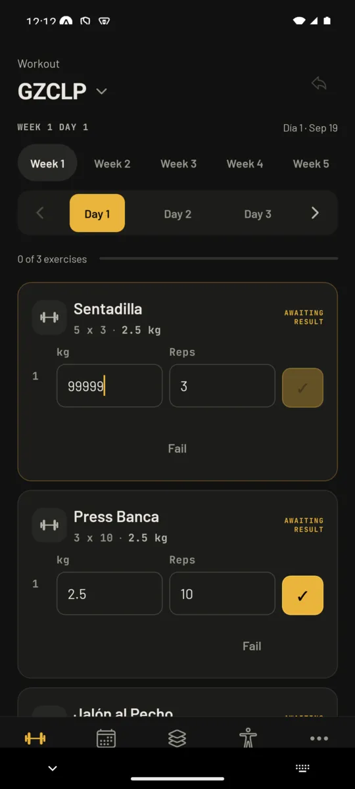
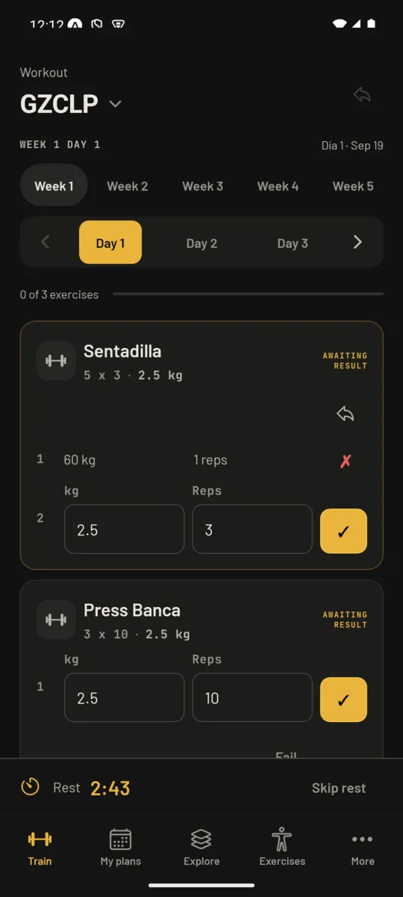
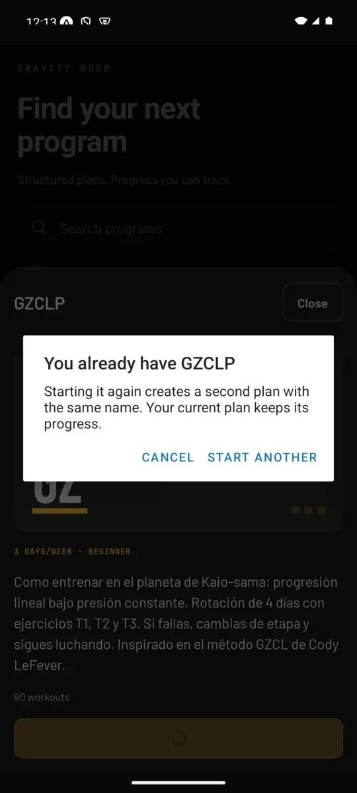
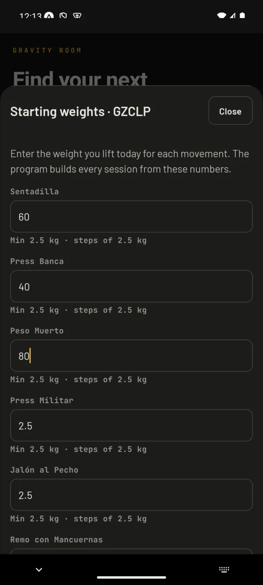
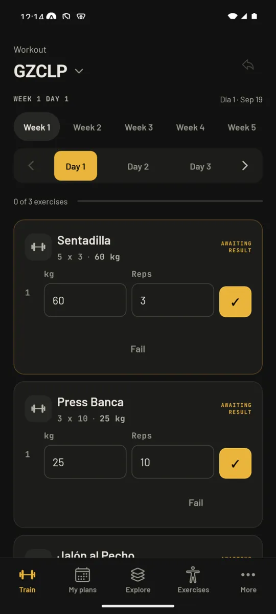
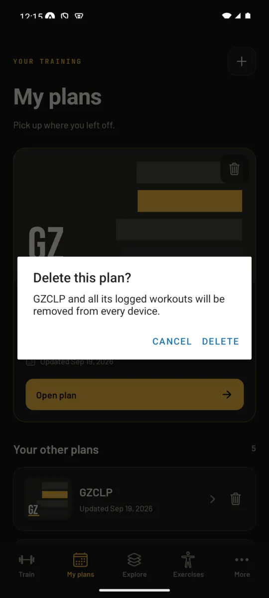
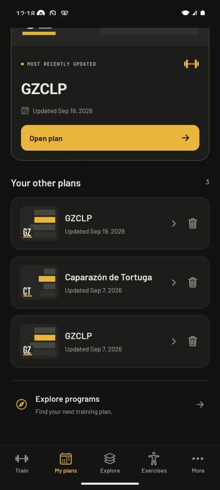
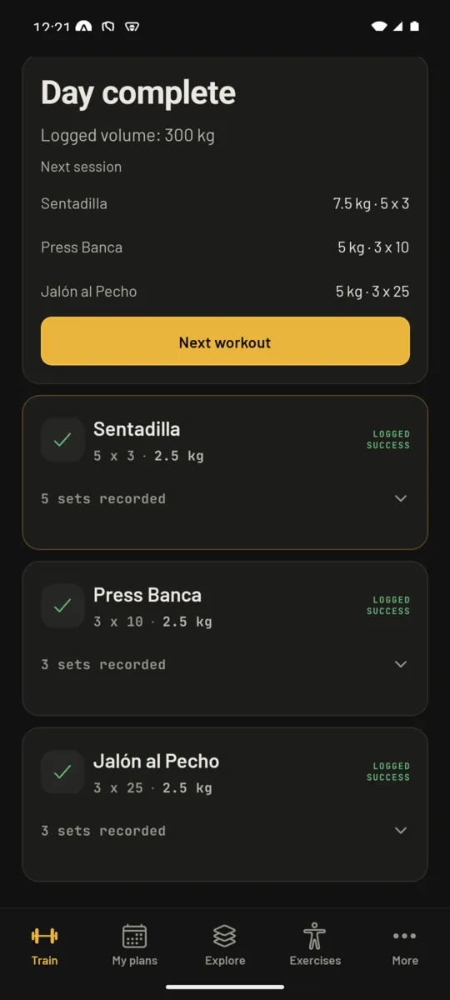
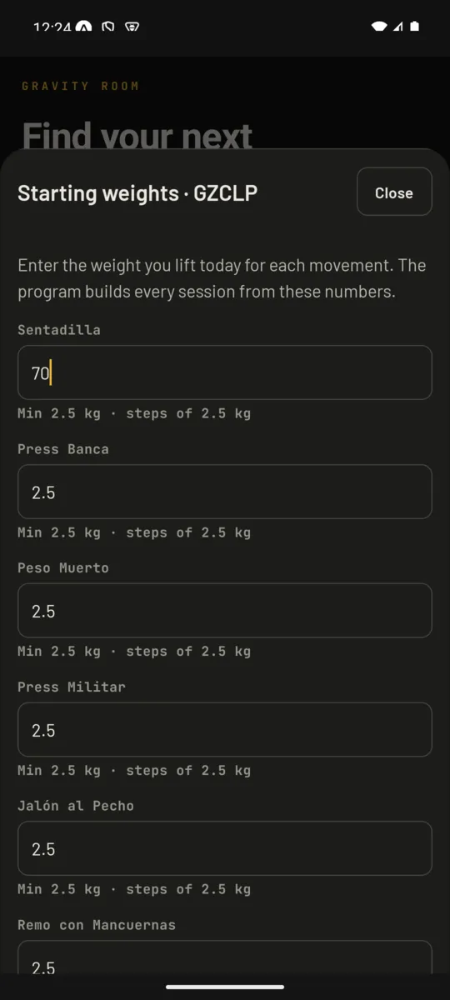

# Gym-flow fixes: emulator evidence

Same setup as the parent verification: Android emulator (Pixel-class, API 35),
Expo Go served by Metro from this branch, local API and Postgres. Screens are
half-resolution WebP captures.

| Fix | Evidence                                                                                                                                                                                                                                                    |
| --- | ----------------------------------------------------------------------------------------------------------------------------------------------------------------------------------------------------------------------------------------------------------- |
| F1  |  `uiautomator` reports the confirm button `enabled="false"` with 99999 kg typed.                                                                                                     |
| F2  |  The draft also survived a force-stop of the app.                                                                                                                    |
| F11 |  Start on a program the lifter already has asks first.                                                                                                                                               |
| F5  |   Postgres `program_instances.program_config` for the new instance: `{"squat": 60, "bench": 40, "deadlift": 80, "ohp": 2.5, ...}`. |
| F12 |   API log: `DELETE /api/programs/:id` → 204; the row is gone from Postgres and the list drops from 5 to 4 without a notice.                                 |
| F7  | Two force-stop + relaunch cycles on the Train tab: the "cached tracker data" notice never stayed on screen (checked at 7 s and 17 s). Before the fix the same relaunch showed it. The auto-retry path itself is covered by a unit test.                     |
| F8  |  Non-regression: the heading still renders when previews exist. The empty case is covered by a unit test; reaching a day with no matching later slot takes a full extra session.          |

## Found while verifying

- **Overlapping exclusive SQLite transactions fail.** The first delete attempt
  ran the summary removal and the local purge in `Promise.all`; the API returned
  204 but the second transaction threw, the screen showed the delete error and
  hid the list. Fixed by awaiting them sequentially and by showing the delete
  error as a notice that does not hide the plans. Rule recorded in
  [`docs/agents/mobile-storage.md`](../../../agents/mobile-storage.md).
- **Android's "hide keyboard" button closed the sheet** (F13, see
  ). The IME back press
  reaches the modal's `onRequestClose`, so hiding the keyboard after typing three
  weights discarded the form. `Sheet` now only dismisses the keyboard when it is
  visible and closes on the next back press.
- **Review follow-ups.** The weight bound lives in `SetLogEntryInputSchema`
  (new entries) while stored history keeps the permissive `SetLogEntrySchema`,
  so hydration with `.catch({})` can never wipe results over one oversized set.
  The cached-bootstrap auto-retry fires once per notice episode instead of once
  per sync snapshot (every flush publishes a new snapshot, which would loop).
  Plan deletion holds an in-flight lock.
- Metro's file watcher did not pick up files created after it started; the
  emulator ran stale code until Metro was restarted with `--clear`. Restart Metro
  after adding files when verifying on device.
