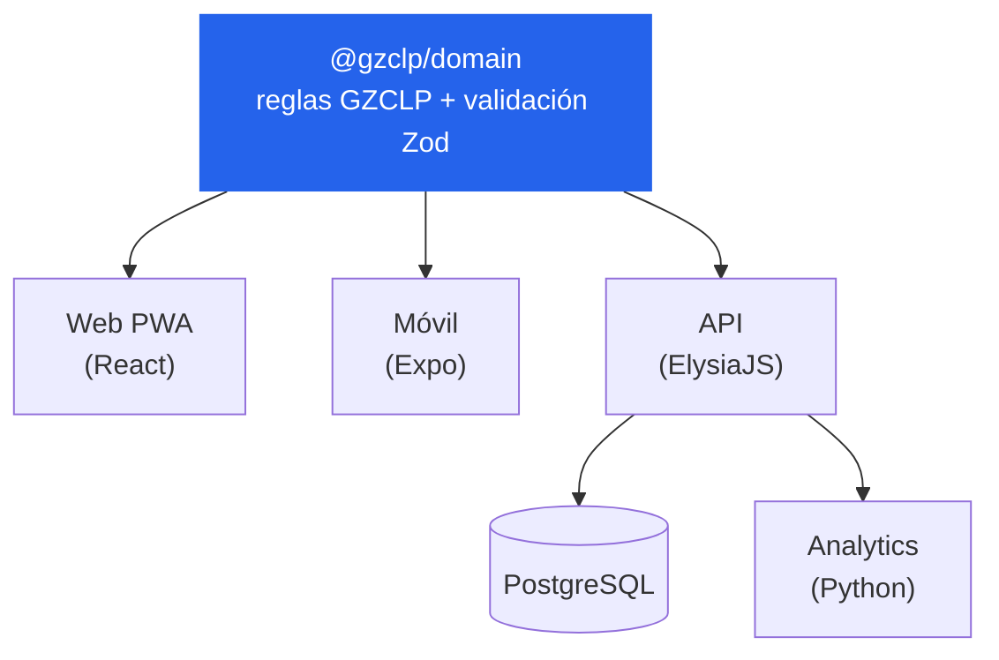
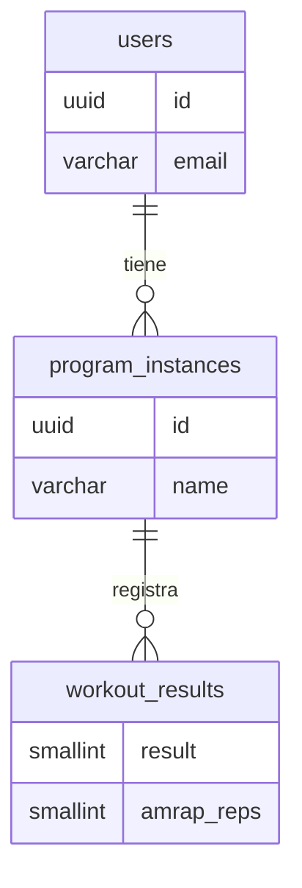

# Gravity Room

Aplicación web para entrenar con **progresión automática** · método GZCLP

<div class="pt-10 opacity-80 text-lg">
  Proyecto Fin de Ciclo · Desarrollo de Aplicaciones Web
</div>

<div class="abs-br m-6 text-sm opacity-70 text-left">
  [Tu nombre]<br>
  Tutor/a: [Nombre] · [Fecha]
</div>

<!--
Buenos días. Soy [nombre] y os presento Gravity Room, una aplicación web para
seguir entrenamientos de fuerza con progresión automática. Es mi proyecto del
ciclo de Desarrollo de Aplicaciones Web.
-->

---

## layout: two-cols

# El problema

Llevar el método **GZCLP** a mano es un caos:

- Cada sesión decides si **subes peso, repites o bajas**
- Los cálculos manuales son tediosos y propensos a errores
- Las hojas de cálculo se rompen en cuanto el método se complica

::right::

<div class="pl-6 pt-12">

### La solución

**Gravity Room automatiza toda la lógica.**

Tú solo registras lo que levantaste y la app **decide la siguiente sesión** por ti.

</div>

<!--
El método GZCLP es un programa de progresión lineal: cada sesión decides si subes
peso, repites o bajas según cómo fue la anterior. Calcular eso a mano es tedioso y
propenso a errores; la gente lo lleva en hojas de cálculo que se rompen en cuanto el
método se complica. Gravity Room automatiza esa lógica: tú solo registras lo que
levantaste y la app decide la siguiente sesión.

(Si entrenas: cuéntalo en primera persona — "esto nació de mi propia frustración".)
-->

---

## layout: default

# Objetivos

<v-clicks>

- 🧠 Implementar el **motor de reglas GZCLP** de forma fiable y reutilizable
- 📱 Construir una **app web (PWA)** rápida y usable desde el móvil
- 🔐 Diseñar una **API propia** con autenticación segura
- 🚀 Desplegar el proyecto en **producción real** (no solo en local)

</v-clicks>

<!--
Me marqué cuatro objetivos: primero, implementar las reglas del método de forma fiable
y reutilizable; segundo, una web instalable como app en el móvil; tercero, una API propia
con login seguro; y cuarto —y esto era ambicioso— ponerlo en producción de verdad.
-->

---

## layout: default

# Estado del arte

| App                  | Qué ofrece                    | Qué le falta                   |
| -------------------- | ----------------------------- | ------------------------------ |
| **Strong**           | Registro genérico de entrenos | No entiende GZCLP              |
| **Boostcamp**        | Programas guiados             | De pago, cerrada               |
| **Hojas de cálculo** | Flexibles                     | Manuales, frágiles, sin lógica |

<div class="pt-8 text-lg">

➡️ **El hueco:** una app **especializada en GZCLP**, gratuita y que **automatiza** la progresión.

</div>

<!--
Existen apps como Strong o Boostcamp, pero o son genéricas y no entienden GZCLP, o son
de pago y cerradas. El hueco que cubro es una app especializada en este método, gratuita
y que automatiza la progresión específica.
-->

---

## layout: default

# Tecnologías

<div class="text-sm">

| Capa                  | Tecnología                                       | Para qué                        |
| --------------------- | ------------------------------------------------ | ------------------------------- |
| **Frontend**          | React 19 · Vite · Tailwind · PWA                 | Interfaz instalable en el móvil |
| **Backend**           | ElysiaJS sobre **Bun**                           | API REST (~31 endpoints)        |
| **Base de datos**     | PostgreSQL · Drizzle ORM                         | Persistencia (10 tablas)        |
| **Lógica compartida** | TypeScript · Zod                                 | Reglas del método GZCLP         |
| **Extras**            | Expo (móvil) · Python + scikit-learn (analítica) | Ambición del proyecto           |

</div>

<div class="pt-6 opacity-80">
Todo TypeScript en front y back · <b>Bun</b> como runtime (más rápido que Node)
</div>

<!--
El stack está moderno y todo en TypeScript en el frontend y el backend. Uso Bun como
runtime, que es más rápido que Node; PostgreSQL con el ORM Drizzle para los datos; y un
detalle clave: la lógica del método vive en un paquete compartido. Además tiene una app
móvil con Expo y un pequeño servicio de analítica en Python. (Una frase por capa, no te
enrolles tecnología por tecnología.)
-->

---

## layout: default

# Arquitectura general



La pieza central es el **paquete de dominio**: una sola fuente de verdad consumida por los tres clientes.

<!--
Esta es la arquitectura. La pieza central es el paquete de dominio: las reglas del método
GZCLP están en un único sitio. La web, el móvil y la API lo importan, así que no hay lógica
duplicada: si corrijo una regla, se corrige en todos lados a la vez. La API guarda los datos
en PostgreSQL y se apoya en un servicio en Python para la analítica.

(Esta es tu slide más importante: apréndetela para defenderla en preguntas.)
-->

---

## layout: two-cols

# Punto fuerte 1

## Una sola fuente de verdad

❌ **Alternativa fácil:** copiar las reglas en web, móvil y servidor → se desincronizan, aparecen bugs.

✅ **Mi decisión:** un **paquete compartido** con TypeScript + Zod que además **valida los datos** con el mismo esquema en cliente y servidor.

::right::

<div class="pl-6 pt-4">

```ts
// packages/domain — importado por
// web, móvil y API (workspace:*)

export const WorkoutResult =
  z.enum(['completed', 'failed', ...])

// Las reglas del método viven aquí,
// no duplicadas en cada cliente
export function nextSession(
  prev: SessionState
): SessionState {
  /* progresión GZCLP */
}
```

</div>

<!--
La decisión de la que estoy más orgulloso. La alternativa fácil habría sido copiar las
reglas en cada cliente, pero eso genera bugs en cuanto uno se actualiza y otro no. En su
lugar usé un paquete compartido con TypeScript y Zod, que además valida los datos tanto
en el navegador como en el servidor con el mismo esquema. Es la diferencia entre un
proyecto de juguete y uno mantenible.
-->

---

## layout: two-cols

# Punto fuerte 2

## API + base de datos

- API propia con **~31 endpoints**
- Login con **JWT + rotación de refresh tokens** (tokens cortos que se renuevan de forma segura)
- Entrar también con **Google**
- **Migraciones automáticas** al arrancar

::right::

<div class="pl-6 pt-4">



</div>

<!--
La API la diseñé yo, con unos 31 endpoints. El login usa JWT con rotación de refresh
tokens —tokens de corta duración que se renuevan de forma segura— y permite entrar con
Google. Los datos se modelan en PostgreSQL: usuarios, sus programas de entrenamiento y
cada resultado de cada serie. Las migraciones se aplican automáticamente al arrancar.
-->

---

layout: center
class: text-center

---

# Demo

<div class="opacity-80 pt-4">

El producto funcionando

</div>

<div class="grid grid-cols-2 gap-4 pt-8 text-sm text-left max-w-3xl mx-auto">
  <div class="p-4 rounded border border-gray-500/40">1 · Elegir programa de entrenamiento</div>
  <div class="p-4 rounded border border-gray-500/40">2 · Registrar las series realizadas</div>
  <div class="p-4 rounded border border-gray-500/40">3 · La app calcula la siguiente sesión</div>
  <div class="p-4 rounded border border-gray-500/40">4 · Ver progreso e histórico</div>
</div>

<!--
TODO: sustituir esta slide por capturas reales o un clip corto (30-60s).
Coloca las imágenes en presentation/images/ y referencia con 

Narración: Vamos a verlo funcionando. El usuario elige su programa, registra las
repeticiones que hizo, y al guardar la app aplica automáticamente la regla del método:
como completó todas las series, le sube el peso para la próxima vez. Aquí ve su histórico
y progreso. Todo es responsive y se puede instalar en el móvil como una app.

(Slide estrella: dedícale tiempo y energía, que se note que funciona.)
-->

---

## layout: default

# Despliegue y calidad

<div class="text-xl pt-2 pb-4 opacity-90">En producción, no en local 🚀</div>

<v-clicks>

- 🐳 **Desplegado en un servidor propio** (Docker)
- 🔄 **Integración continua** con GitHub Actions: tests + comprobaciones de calidad en cada cambio
- 📊 **Monitorización de errores** con Sentry
- ✅ Flujo de trabajo **profesional** de principio a fin

</v-clicks>

<!--
Y no se queda en mi portátil: está desplegado en producción en un servidor propio. Tengo
integración continua con GitHub Actions que ejecuta los tests y comprueba la calidad en
cada cambio, y monitorización de errores con Sentry. Es un flujo de trabajo profesional.

(Este punto te diferencia de casi cualquier otro proyecto DAW. No lo escondas.)
-->

---

## layout: default

# Resultados y conclusiones

**Logros**

- ✔️ Los 4 objetivos cumplidos: app funcional, desplegada y usable
- ✔️ Web instalable, API segura, automatización del método

**Lo que aprendí**

- 🧩 Diseñar para **no repetirme** (el paquete compartido)
- 🚀 Todo el proceso de **llevar algo a producción**
- 🛠️ Me peleé con _[algo honesto: el despliegue, la autenticación…]_

<!--
Como resultado: cumplí los cuatro objetivos. Tengo una app funcional, desplegada y usable.
Lo que más aprendí fue diseñar para no repetirme —el paquete compartido— y todo el proceso
de llevar algo a producción, que en clase no se ve tanto. También me peleé con [algo honesto].

(La honestidad sobre dificultades suma puntos. No vendas perfección.)
-->

---

## layout: default

# Líneas futuras

<v-clicks>

- 🔗 Unificar el **cliente de la API** entre web y móvil (`packages/api-client`)
- 📈 Ampliar la **analítica** con recomendaciones personalizadas
- 🏋️ Soportar **más programas** de entrenamiento además de GZCLP

</v-clicks>

<!--
De cara al futuro: unificar el cliente de la API entre web y móvil, ampliar la parte de
analítica con recomendaciones, y soportar más programas de entrenamiento además de GZCLP.
-->

---

layout: center
class: text-center

---

# ¡Gracias!

<div class="pt-4 text-lg opacity-90">

Gravity Room está disponible en **https://[tu-dominio]**

</div>

<div class="pt-8 opacity-70">

¿Preguntas?

</div>

<!--
Y hasta aquí Gravity Room. Está disponible en [URL]. Muchas gracias, quedo a vuestra
disposición para preguntas.

RECUERDA: sustituye [tu-dominio] por la URL real de producción.
-->
